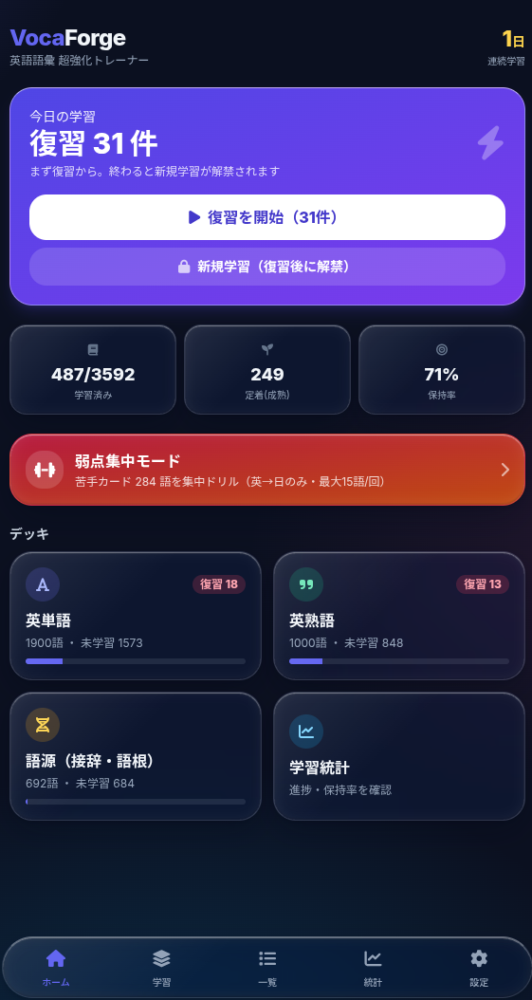
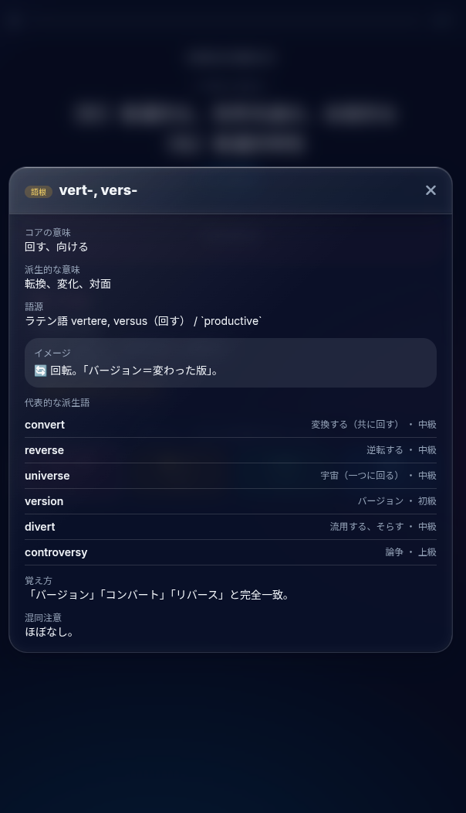

# VocaForge — 英語語彙 超強化トレーナー

ズボラでも、面倒くさがりでも、ある程度続けられることを目指した英語語彙学習アプリです。学校の学習に合わせやすいよう、一部の参考書と同じ並びで学べます。さらに、英語の語彙のパーツである接頭辞・接尾辞・語根692件を、単語2,355語とリンクして学べます。将来的に、日本人の英語の実力を伸ばせるものにしたい、というのが作者の目標です。

*English: VocaForge is a browser-based English vocabulary trainer for Japanese learners. It links 692 etymology cards (prefixes, suffixes and roots) to 2,355 words and schedules reviews with a self-implemented FSRS-style spaced-repetition scheduler.*

**デモ**: https://vocaforgestudyedition.pages.dev/




## 特徴

- **語源でつながる**: 語源カード（接頭辞・接尾辞・語根692件）から単語へ、単語から語源へ、タップでたどれます。
- **出題形式が自動で変わる**: 未学習の単語は選択式、復習は記入式。認識から想起へ、段階的に進みます。
- **例文の穴埋め・弱点集中・フラッシュカード**: 復習の一部を例文の穴埋めにしたり、苦手なカードだけをドリルしたりできます。
- **復習の間隔は FSRS で調整**: 自前実装の FSRS-7 を使っています。個人最適化は実験的な機能です。
- **続けやすさ**: 連続学習日数と統計を表示します。ログインしなくても使え、Google ログインでクラウド同期もできます（任意）。

## 開発について

設計と方針は作者が決め、実装とデータ整備は複数のAIを使い分けて進めています。

- **Genspark**: コーディング・実装全般
- **Notion（タスクエージェント）・ClickUp AI・Google AI Studio**: データ作成
- **Claude・ChatGPT**: アイデア出し

例文はAIが生成したものです。単語・熟語の並びは一部の参考書に沿っており、その部分のデータは再利用を許諾していません（次の「データとライセンスについて」を参照）。

## データとライセンスについて

このリポジトリのライセンス（MIT）が適用されるのは、**ソースコードと語源データ（`public/static/data/etymology.json`）のみ**です。

`public/static/data/` のその他の単語・熟語データ、および `vocab_work/` のファイルは、作者の個人学習用に含まれているもので、**再利用・再配布は許諾していません**（ライセンスの対象外です）。

権利者の方で掲載の見直しをご希望の場合は、このリポジトリの Issue でお知らせください。速やかに対応します。

*English: The MIT license covers the source code and the etymology dataset (`public/static/data/etymology.json`) only. The vocabulary and phrase datasets and the files under `vocab_work/` are included for the author's personal study and are not licensed for reuse or redistribution.*

## 使い方

1. ホームの「復習を開始 / 新規学習を開始」で今日の学習を始める。または「学習」タブからデッキ・セクションを選ぶ。
2. 出題に答える（選択 or 入力）。答えると正解・意味が表示される。
3. 手応えを「もう一度／難しい／できた／簡単」で評価（キーボード 1〜4 でも可）。これで次回の復習日が決まる。
4. 毎日続けると「連続学習日数」が伸び、忘れかけたタイミングで自動的に復習が出題される。
5. 「統計」タブで保持率や進捗、「設定」タブで学習ペースや出題形式を調整できる。
6. 機種変更や別ブラウザへの引き継ぎは、「設定」タブ →「データの管理」からエクスポート（ファイル保存）／インポート（読み込み）で行う。

## プロジェクト概要

- **名称**: VocaForge
- **目的**: 英語語彙力の超強化（特定大学対策ではなく、汎用的な語彙力底上げ）
- **対象データ**:
  - 英単語 **1900語**（ターゲット1900 / 100語ごと全19セクション）、**全部バージョン 6559語**（意味カテゴリ別 全53セクション：「#01 重要な・ささいな」〜「#46 接続詞・副詞・前置詞」。語源ヒント・類義語グループ付き）、**Leap 2297語**（全23セクション）の3データセットを設定で切替可能。同一単語の学習進捗は全データセットで共有
  - 英熟語 **1000語**（英熟語ターゲット1000 5訂版の公式パート構成に準拠：Part1 絶対覚えておきたい180 / Part2 グルーピングで覚える240 / Part3 形で覚える240 / Part4 文法・構文で覚える170 / Part5 ここで差がつく難熟語170）、**全部バージョン 3238熟語**（意味カテゴリ別全48セクション・補足/例文/例文訳付き）の2データセットを設定で切替可能。どちらも新DB由来の補足・例文・例文訳付き。同一熟語の学習進捗は両データセットで共有（共通1000熟語は `p-N` IDを共用、新規熟語は `pf-N`）
  - 語源 **692件**（接頭辞159・接尾辞160・語根373。**全件が学習カード**）。接頭辞・接尾辞・語根それぞれを**意味（テーマ大分類：方向・位置／時間／数量・程度…）でグルーピング**し、単語のSection・熟語のPartと同じ選択単位として学習・フラッシュカードで扱える（全39グループ）
  - 語源の出題は**コア意味に派生的な意味を併記**（例「場所（位置、地方）」「場所（地形、論題）」）して識別性を確保。同じコア意味の接辞・語根（loc-とtop-など）が区別できるようにし、入力形式では語源言語をヒント表示（例「ラテン語 locus」）。これにより692カード全ての意味ラベルが一意になる
  - 2026-08-11 に **v2 データセットへ更新**（+149件の新規語源、旧「参照ノート」51件は本体エントリへ統合して削除）。旧データで学習カードだった539件のIDは**全て維持**しているため、既存の学習進捗（`card_states`）は引き継がれる。詳細は [`docs/etymology-v2-update.md`](docs/etymology-v2-update.md)
  - 2026-08-14 に **ゲーム版の整備結果を取り込み 688→692件**（新規 `Root-901`/`Root-902`/`Root-903`/`Suf-901`）。例単語の和訳に「語源の理屈」の補足が383件追記された。既存688件のIDは全て保全。なお取り込み時に `origin` の表記規約（生産性キーワードのバッククォート囲み・言語名の「〜語」表記）が巻き戻っていたため補正済み（囲みが外れると `productive` などの内部情報が学習ヒントに露出する）
- **設計根拠**: 学習科学の知見（能動的想起・分散学習・インターリービングなど）に基づく設計

## 完成した機能

- **例文穴埋めクイズ（cloze）**: 復習カードの40%で例文中の出題語をブランク化して出題（活用形・不規則変化対応、単語99%/熟語74%カバー、対象外は記入式にフォールバック）。設定でON/OFF可
- **弱点集中モード**: リーチ語・失敗2回以上・FSRS難易度6.5以上のカードを弱さ順に最大15語/回でドリル（ホーム・統計画面から起動、採点は通常どおりFSRSに反映）
- **語源ヒント連携**: 単語カードの語源欄と関連する語源カード（接辞・語根692枚）を自動リンク（2,355語・etym_links.json）。解答後フィードバックと単語詳細モーダルにチップ表示、タップで語源詳細を開く
- **3つの出題形式**（学習科学の「能動的想起の強制」に対応）
  - 選択：英→日（英語を見て意味を選ぶ）
  - 選択：日→英（日本語を見て英語を選ぶ）
  - 記入：日→英（日本語を見て英語をタイプ。最も強力な想起）
  - **出題形式の自動制御**：未学習カードは必ず選択式（記入以外）、復習カードは必ず記入式で出題（認識→想起の段階的学習）
  - **混同検出**：記入式で不正解のとき、入力がDB内の別の単語・熟語と一致していたら「混同しているかも？」と警告し、その語の詳細（発音・品詞・意味・例文）をその場で確認できる
- **フラッシュカードモード**（「一覧」タブから起動）
  - デッキ（単語/熟語/語源）とセクションを選んでカードをめくる自由閲覧モード
  - 表⇄裏のタップ/キーでフリップ、英→日／日→英の向き切替、シャッフル、「あとで」マーク
  - キーボード操作（← →で移動、Space/Enterでめくる、Escで終了）
  - めくり終わったらそのままテスト出題へ移行可能（定着）
  - 熟語のセクションは英熟語ターゲット1000の公式パート構成で選択
- **FSRS-7 スケジューラ**（自前実装）：デュアル忘却曲線・短期/長期2系統の安定度更新・小数日間隔対応。Again/Hard/Good/Easy の4段階自己評価。各評価で次回間隔をプレビュー表示。
- **オンデバイス個人最適化（optimizer.js・実験的）**：復習履歴300件以上で、FSRS-7のパラメータを自分の記憶パターンに座標降下法でフィッティング。時系列ホールドアウト検証で過学習を防止し、改善しない場合は適用しない。処理は全て端末内で完結。※このアプリでの効果は未検証です。
- **スマートfuzz**：間隔±5%のランダム化（Anki本体と同方式）で復習日の集中と「並びで覚える」癖を防止。
- **Retrievability降順の復習並び**：Anki公式シミュレーションで「同じ保持率を最少の学習時間で維持できる最良の並び」と結論づけられた方式を採用。
- **復習キューの自動生成**：復習期限カードを優先し、1日の新規カード上限を尊重。
- **インターリービング**：カテゴリを混ぜて出題（交互練習）。設定でON/OFF。
- **記入の柔軟採点**：大小文字・記号・空白の差を許容（厳密採点も選択可）。熟語の `of/about` 等のスラッシュ表記両対応、スペル違いの検出。
- **リーチ（苦手カード）検出**：規定回数以上間違えたカードを統計で警告。
- **完全な復習ログ保存**：card_id・日時・評価・経過日数・所要時間・S/D前後値（将来のFSRSパラメータ最適化に対応）。
- **学習統計**：連続学習日数、直近保持率、総復習回数、記憶ステージ別件数、直近14日の学習量グラフ。
- **語彙一覧・検索・詳細**：全語彙をブラウズ・検索。語源カードは派生語・イメージ・覚え方・混同注意まで詳細表示。
- **設定**：目標保持率、1日の新規上限、セクション学習の新規カード数（10〜100・既定50）、出題形式のON/OFF、インターリービング、採点厳格度、データリセット。
- **データのエクスポート/インポート**：学習進捗・記憶状態・統計をJSONファイルに書き出し（エクスポート）、別端末・別ブラウザへ引き継ぎ可能（インポート）。インポートは「統合（足し合わせ）」「置換（上書き）」を選択でき、不正ファイルは自動で拒否する。
- **データは既定でローカル完結**：学習進捗・FSRS状態・ログは localStorage に保存（ログインしなければ、サーバーには送られません）。バックアップはエクスポート機能で取得。
- **Supabase 認証（Googleログイン）**：「設定」タブの「アカウント」からGoogleアカウントでログイン／ログアウト可能。Supabase JS SDK v2（esm.sh CDN、ESモジュール）を `supabase-auth.js` で初期化し、`signInWithOAuth({provider:'google'})`（リダイレクト方式）を使用。ログイン状態は `persistSession` で永続化し、`window.VFAuth` 経由で非moduleのアプリ本体と橋渡しする。
- **クラウド同期（Supabase Database）**：ログインすると学習データ（カード記憶状態・ログ・設定・日次・既出）を Supabase の `user_data` テーブル（`user_id` 1行・`jsonb`）に自動同期。ローカル更新をデバウンス（約1.5秒）して `upsert` で保存し、複数端末間で進捗を共有できる。設定画面に同期ステータス（同期中／保存済み／エラー）を表示。
- **ゲストデータの引き継ぎと競合解決**：ログイン前（未ログイン=localStorage）に進めた学習データは、初回ログイン時に Supabase へ引き継ぐ。クラウド側にも既にデータがある場合は、**最終更新時刻が新しい方を自動採用**する（newest-wins、確認ダイアログなし・全置換）。注意: 2端末で同日に並行学習した場合、古い方の端末の当日分は上書きされる（フィールド単位のマージは行わない）。ログアウト時は未同期分をクラウドへ保存してからローカルデータを消去し、保存に失敗した場合は警告を表示して確認を求める。

## 技術構成

- **バックエンド**: Hono（Cloudflare Pages / Workers）— 静的データ配信＋SPA配信
- **フロントエンド**: Vanilla JS（依存最小）＋ TailwindCSS（CDN）＋ Font Awesome
- **アルゴリズム**: FSRS-7（自前実装）。srs-benchmarkのmulti-user最適化デフォルト重み＋オンデバイス座標降下法による個人パラメータ最適化（optimizer.js）
- **永続化**: ブラウザ localStorage
- **認証**: Supabase Auth（Google OAuth、JS SDK v2）
- **クラウド同期**: Supabase Database（`public.user_data` に学習データを1行=jsonbで保存、デバウンス自動同期）

## ローカルで動かす

Node.js 20.3 以上が必要です（Node.js 22 で動作確認しています）。

```bash
git clone https://github.com/skyvesmir/vocaforge.git
cd vocaforge
npm install
npm run dev
# 開発サーバー: http://localhost:5173
```

Cloudflare Pages に近い環境で確認するときは、ビルドしてからプレビューします。

```bash
npm run build
npm run preview
# http://localhost:8788
```

`pm2` で動かす場合は、`ecosystem.config.cjs`（ポート3000）を使います。

## デプロイ

- **プラットフォーム**: Cloudflare Pages
- **本番URL**: https://vocaforgestudyedition.pages.dev
- **プロジェクト名**: `vocaforgestudyedition`（production branch: `main`）
- **自動デプロイ**: Cloudflare Pages の GitHub 連携により、`main` への push で自動デプロイされます（ビルドコマンド `npm run build`、出力ディレクトリ `dist`）。
- **手動デプロイ**: `npx wrangler login` のあと `npm run deploy`。

### 接続情報（Supabase）

`public/static/config.js` の `window.VF_CONFIG` に集約しています。anon key は公開前提の値なので、意図的にリポジトリへコミットしています（`.gitignore` には入れません）。実際の保護は Supabase の RLS（`auth.uid() = user_id`）が担います。`config.js` が読めない場合は、クラウド同期を諦めてローカルのみで動作します（白画面にはなりません）。

### 自分の環境で動かす場合（Supabase の設定）

`config.js` の接続先は作者の Supabase プロジェクトです。フォークして使う場合は、自分のプロジェクトを用意して `config.js` を書き換えてください。ログインしなくても、ローカルだけで学習はできます。

- Authentication → Providers で **Google を有効化**（Google Cloud の OAuth クライアントID/シークレットを登録）。
- Authentication → URL Configuration の **Redirect URLs** に、公開URLとローカルのURL（`http://localhost:5173` など）を追加。
- **`user_data` テーブルを作成**し、RLS を有効化して「本人の行のみ読み書き可」ポリシーを設定（下記SQL）。

```sql
create table public.user_data (
  user_id uuid primary key references auth.users(id) on delete cascade,
  data jsonb,
  updated_at timestamptz default now(),
  updated_at_ms bigint
);
alter table public.user_data enable row level security;
create policy "own rows" on public.user_data
  for all using (auth.uid() = user_id) with check (auth.uid() = user_id);
```

## データ構造

- **語彙カード（単語・熟語）**: `{id, no, term(英), meaning(日), section, sectionCode, sectionTitle, sectionRange}`（熟語のsectionは公式Part番号）
- **熟語全部バージョン（phrases_full.json）**: `{id(p-N共有/pf-N新規), no, term, meaning, section(1-48), sectionTitle(意味カテゴリ名), note?, example?, exampleJa?}`。meta.json の `phrase_full_sections` に48セクションの `{section, title, count}`
- **単語全部バージョン（words_full.json）**: `{id(w-N共有/wf-N新規), no, term, ipa, pos, meaning, section(1-53), note?, example?, exampleJa?, etym?(語源ヒント), syn?(類義語グループ)}`。並びは意味カテゴリ別グルーピング済みCSVに準拠。全エントリの meaning は品詞マーカー（【名】【他】【自】【形】等）付き（2026-07-24 完全化。words_target.json も同形式に統一）。meta.json の `word_full_sections` に53セクションの `{section, title, count}`（旧CSVにのみあった6語は意味で正しい位置に挿入：dispute→#17b議論・論争のcontroversy隣、torture→#22b犯罪・法のpunitive隣、troop/shield/warrior/assault→#45b軍事・戦争のbattalion/weapon/soldier/raid隣）
- **語源カード**: `{id, category(prefix/suffix/root), headword, variants, theme, themeGroup(意味大分類), group("category:themeGroup"複合キー), core(コア意味), derived, origin, image_hint, examples[], tips, confusion, importance, learnable}`
- **語源グループ（meta.etym_groups）**: `{category, theme, key, count}` — カテゴリ×意味大分類の選択単位（39グループ）
- **記憶状態（localStorage）**: `{state, stability(S), difficulty(D), due, last_review, reps, lapses, is_leech}`（FSRS）
- **クラウド行（Supabase `public.user_data`）**: `{user_id(uuid, PK), data(jsonb):{cards, logs, settings, daily, seen}, updated_at(timestamptz), updated_at_ms(bigint)}`
- **復習ログ（localStorage）**: `{card_id, reviewed_at, grade, format, elapsed_days, duration_ms, s_before/after, d_before/after}`
- **バックアップファイル（エクスポート/インポート）**: `{app:'vocaforge', type:'vocaforge-backup', version, exportedAt, data:{cards, logs, settings, daily, seen}}`

## HTTPエンドポイント

- `GET /` — アプリ本体（SPA）
- `GET /api/health` — ヘルスチェック（`{ok:true,name:"VocaForge"}`）
- `GET /static/data/etymology.json` — 語源データ692件（MIT）

アプリは、このほかの学習データも `/static/data/` から読み込みます（「データとライセンスについて」を参照）。

## 今後の予定

- 音声読み上げ（TTS）による発音学習
- SSP-MMC型の「コスト最小化スケジューリング」（目標保持率固定の代わりに学習時間/知識量のトレードオフを直接最適化。公式検証では高い固定DRに勝てないとの結果のため現状見送り）
- コロケーション（語の典型的な組み合わせ）の追加

## コントリビュート

語源データ（`public/static/data/etymology.json`）の誤りの指摘や、補足の提案を歓迎します。[Issue（語源データの修正・追記）](https://github.com/skyvesmir/vocaforge/issues/new?template=etymology-fix.md) から送ってください。

特に助かるのは、例単語の訳の見直し、`confusion`（似た語根の区別）が空欄のカードの追記、語源欄が言語名だけのカードの補足です。
